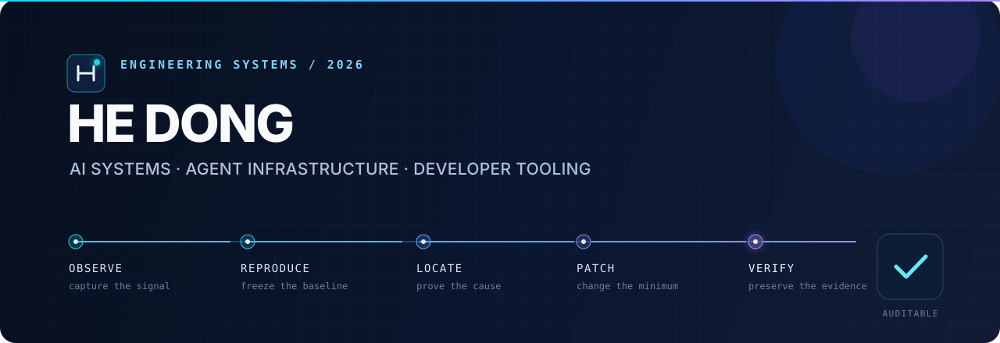

<div align="center">
  <a href="https://wellkilo.github.io/Portfolio/">
    
  </a>

  <br />

  <p>
    <a href="https://wellkilo.github.io/Portfolio/"><strong>Portfolio</strong></a>
    &nbsp;·&nbsp;
    <a href="https://wellkilo.github.io/"><strong>Notes</strong></a>
    &nbsp;·&nbsp;
    <a href="mailto:wellkilo@foxmail.com"><strong>Email</strong></a>
  </p>

  <p>
    
    
    
  </p>
</div>

## About

I am **He Dong**, an M.S. student at the **Beijing Institute of Technology** and a former **Agent Evaluation Infrastructure intern at ByteDance**. I build AI systems that can do useful engineering work while remaining observable, reviewable, and safe to operate.

My work sits at the intersection of **LLM agents**, **AI for code**, **developer tooling**, and **distributed reinforcement learning**. At ByteDance, I worked on AI-assisted engineering workflows that reduced an MR defect-tracing and code-review cycle from **30 minutes to 3 minutes**.

```text
observe  →  reproduce  →  locate  →  patch  →  verify
   evidence at every boundary · humans retain the final decision
```

## Selected work

<table>
  <tr>
    <td width="50%" valign="top">
      <h3><a href="https://github.com/wellkilo/RepoPilot">RepoPilot</a></h3>
      <code>TypeScript</code> <code>AgentTeams</code> <code>MCP</code> <code>PostgreSQL</code>
      <br /><br />
      An evidence-first AgentTeam for repository maintenance. It moves an issue or failed CI run toward a verified pull request while preserving decisions, approvals, tool calls, and rollback points in a tamper-evident execution chain.
      <br /><br />
      <a href="https://wellkilo.github.io/RepoPilot/"><strong>Interactive demo ↗</strong></a> ·
      <a href="https://github.com/wellkilo/repopilot-testbed/pull/4">Verified PR</a>
    </td>
    <td width="50%" valign="top">
      <h3><a href="https://github.com/wellkilo/codemod-pilot">codemod-pilot</a></h3>
      <code>Rust</code> <code>tree-sitter</code> <code>AST</code> <code>CLI</code>
      <br /><br />
      A safe, example-driven codemod engine. Give it before-and-after snippets and it infers a structural transformation, scans a repository, previews the diff, and generates a rollback path before writing.
      <br /><br />
      <a href="https://github.com/wellkilo/codemod-pilot#-quick-start"><strong>Quick start ↗</strong></a>
    </td>
  </tr>
  <tr>
    <td width="50%" valign="top">
      <h3><a href="https://github.com/wellkilo/DRL_MuJoCo">DRL MuJoCo</a></h3>
      <code>Python</code> <code>PyTorch</code> <code>Ray</code> <code>Rust</code>
      <br /><br />
      A distributed Actor–Learner training system for MuJoCo with parallel rollout collection, PPO optimization, multi-GPU experiments, a Rust replay buffer, and real-time experiment observability.
      <br /><br />
      <a href="https://github.com/wellkilo/DRL_MuJoCo"><strong>See the system ↗</strong></a>
    </td>
    <td width="50%" valign="top">
      <h3><a href="https://github.com/wellkilo/conda-helper">conda-helper</a></h3>
      <code>Python</code> <code>Click</code> <code>Cross-platform</code>
      <br /><br />
      A local-first CLI that makes Conda environment backup, restore, clone, offline packaging, cleanup, and diagnosis safer and more repeatable across Windows, macOS, and Linux.
      <br /><br />
      <a href="https://wellkilo.github.io/conda-helper/"><strong>Project site ↗</strong></a> ·
      <a href="https://pypi.org/project/conda-helper/">PyPI</a>
    </td>
  </tr>
  <tr>
    <td width="50%" valign="top">
      <h3><a href="https://github.com/wellkilo/SlideCraft">SlideCraft</a></h3>
      <code>Python</code> <code>HTML</code> <code>PPTX</code> <code>AI Skill</code>
      <br /><br />
      An AI presentation skill that produces animated, zero-dependency HTML decks and editable PowerPoint files through a deliberate theme system designed to avoid generic AI aesthetics.
    </td>
    <td width="50%" valign="top">
      <h3><a href="https://github.com/wellkilo/CaseAI">CaseAI</a></h3>
      <code>TypeScript</code> <code>Agent System</code> <code>Testing</code>
      <br /><br />
      An agent-based system that turns product requirement documents into structured test-case suites, connecting product intent with repeatable quality workflows.
    </td>
  </tr>
</table>

## Engineering principles

| Principle | What it means in practice |
| :--- | :--- |
| **Evidence before confidence** | Reproduce the failure, capture the trace, and make every conclusion inspectable. |
| **Safe autonomy** | Give agents useful tools, explicit boundaries, human approval gates, and reversible actions. |
| **Systems over demos** | Build typed contracts, tests, observability, and deployment paths around the model. |
| **Performance with a baseline** | Measure against a frozen reference and promote changes only when regressions are understood. |

## Working set

<p>
  
  
  
  
  
  
  
  
  
</p>

I am currently exploring reliable agent infrastructure, repository-scale code transformation, evaluation systems, and scalable reinforcement-learning workflows. I am always interested in thoughtful collaborations around these areas.

<div align="center">
  <br />
  <a href="https://wellkilo.github.io/Portfolio/"><strong>View the full portfolio</strong></a>
  &nbsp;·&nbsp;
  <a href="mailto:wellkilo@foxmail.com"><strong>Start a conversation</strong></a>
  <br /><br />
  <sub>Build the evidence. Keep the decision reversible.</sub>
</div>
